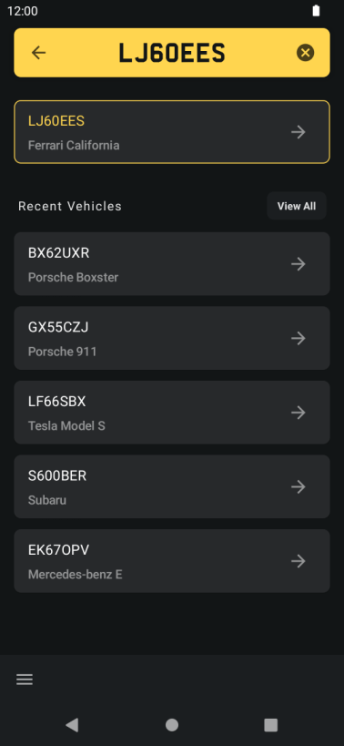
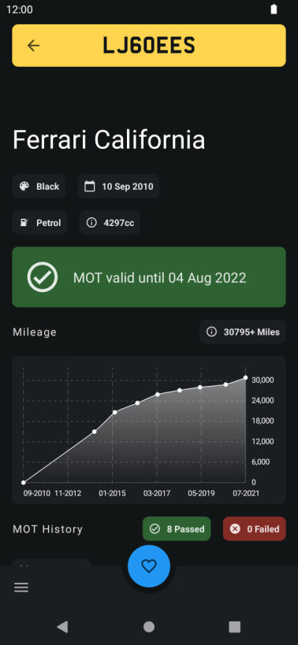
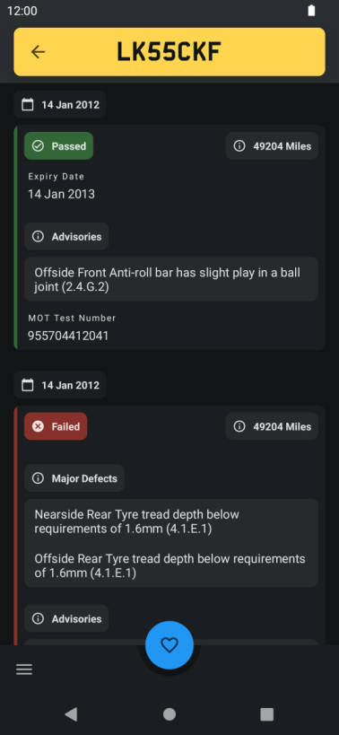

# MOT Checker [In Development]

MOT Checker is an Android application providing vehicle information & MOT history for vehicles
registered in the UK. The application is written entirely with Kotlin and Jetpack Compose.
 
All data is sourced using the official [DVSA MOT History API](https://dvsa.github.io/mot-history-api-documentation/).  

# Screenshots




<p>&nbsp;</p>




# Features

* Vehicle information including make, model, colour, fuel type, and registration date
* Vehicle Mileage information and history
* MOT status and expiry date
* Full vehicle MOT history, test results, reasons for failure, and advisory notices
* Save favourite vehicles for easy access

# Build Configuration

## Prerequisites

In order to build and run the project, an MOT History API key is required from the DVSA. Instructions
for applying for an API key can be found [here](https://dvsa.github.io/mot-history-api-documentation/). Once aquired, the API key
should be added as an environment variable named `MOT_API_KEY`.

## Gradle Convention Plugins
The project makes use of Gradle convention plugins in order to define common configuration for particular types of modules. This approach is described in Gradle's [Structuring Large Projects](https://docs.gradle.org/release-nightly/userguide/structuring_software_products.html) documentation.

These convention plugins have a single responsibility, and can be composed and used together. The following convention plugins are defined within the `build-logic` directory:
* [`motchecker.android.application`](build-logic/convention/src/main/kotlin/AndroidApplicationConventionPlugin.kt): Defines common Android `Application` configurations
* [`motchecker.android.application.compose`](build-logic/convention/src/main/kotlin/AndroidApplicationComposeConventionPlugin.kt): Defines compose configuration for an Android `Application`
* [`motchecker.android.library`](build-logic/convention/src/main/kotlin/AndroidLibraryConventionPlugin.kt): Defines the configuration for an Android library which is to be consumed by other modules
* [`motchecker.android.library.compose`](build-logic/convention/src/main/kotlin/AndroidLibraryComposeConventionPlugin.kt):
  Defines compose configuration for an Android library
* [`motchecker.android.library.test`](build-logic/convention/src/main/kotlin/AndroidLibraryTestConventionPlugin.kt):
  Defines the configuration for an Android library, providing test helper classes and dependencies,
  which is to be consumed by other modules
* [`motchecker.android.feature`](build-logic/convention/src/main/kotlin/AndroidFeatureConventionPlugin.kt):
  Defines the configuration for a feature module within the application
* [`motchecker.detekt`](build-logic/convention/src/main/kotlin/DetektConventionPlugin.kt): Configures [detekt](https://github.com/detekt/detekt) for a module, allowing static analysis to be ran against the module when running the root `:detekt` task
  

These can be applied by the relevant modules, allowing build logic to be shared without duplication. For example, the `build.gradle` of a feature module, which is consumed by other modules, and makes use of compose and detekt, could be defined as:

```
plugins {
    id("motchecker.android.feature")
    id("motchecker.android.library")
    id("motchecker.android.library.compose")
    id("motchecker.detekt")
    // And any other plugins specific to this module
}

dependencies {
   // Any dependencies specific to this module
}

```

## Version Catalog
For dependency management and versioning, Gradle's [version catalogs](https://docs.gradle.org/current/userguide/platforms.html) are used, allowing for sharing of dependency versions between modules. Gradle will generate type-safe accessors for the dependencies within the version catalogue, which can be used by each module.

The dependencies for the project are defined in [`gradle/deps.versions.toml`](gradle/deps.versions.toml), and accessed using the `libs.someLib` notation, e.g.

```
dependencies {
       implementation(libs.retrofit)
}
```

# License

    Copyright 2022 Alexander Green

    Licensed under the Apache License, Version 2.0 (the "License");
    you may not use this file except in compliance with the License.
    You may obtain a copy of the License at

       http://www.apache.org/licenses/LICENSE-2.0

    Unless required by applicable law or agreed to in writing, software
    distributed under the License is distributed on an "AS IS" BASIS,
    WITHOUT WARRANTIES OR CONDITIONS OF ANY KIND, either express or implied.
    See the License for the specific language governing permissions and
    limitations under the License.
