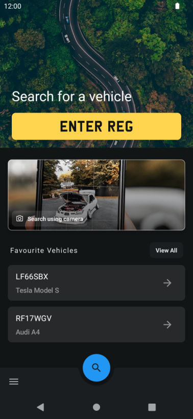

# MOT Checker [In Development]

MOT Checker is an Android application providing vehicle information & MOT history for vehicles
registered in the UK. All data is sourced using the
official [DVSA MOT History API](https://dvsa.github.io/mot-history-api-documentation/). The
application is written entirely with Kotlin and Jetpack Compose.

## Screenshots

## Features

* Vehicle information including make, model, colour, fuel type, and registration date
* Vehicle Mileage information and history
* MOT status and expiry date
* Full vehicle MOT history, test results, reasons for failure, and advisory notices
* Save favourite vehicles for easy access

## Prerequisites

In order to build and run the project an MOT history API key is required from the DVSA. Instructions
for applying for an API key can be
found [here](https://dvsa.github.io/mot-history-api-documentation/). Once aquired, the API key
should be added as an environment variable named `MOT_API_KEY`.

## License

    Copyright 2019 Alexander Green

    Licensed under the Apache License, Version 2.0 (the "License");
    you may not use this file except in compliance with the License.
    You may obtain a copy of the License at

       http://www.apache.org/licenses/LICENSE-2.0

    Unless required by applicable law or agreed to in writing, software
    distributed under the License is distributed on an "AS IS" BASIS,
    WITHOUT WARRANTIES OR CONDITIONS OF ANY KIND, either express or implied.
    See the License for the specific language governing permissions and
    limitations under the License.
